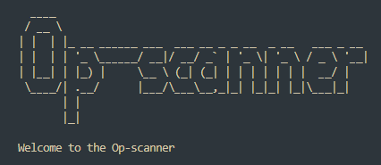

# Op-Scanner

Op-Scanner is a simple, yet powerful, Python port scanning tool designed to identify open and vulnerable ports on a target host. The program also offers DNS and WHOIS lookup functionality to provide additional information about the host.

## Features

- Scan all ports (1-65535) on a target host
- Scan the most vulnerable ports on a target host
- Save the results of the scan to a text file
- Perform a DNS lookup on the host
- Perform a WHOIS lookup on the host

## Installation

1. Clone this repository or download the zip file.

```bash
  git clone https://github.com/Dominic-wells/Op-Scan.git

```

2. Install the required dependencies.

```bash
  pip install alive-progress pyfiglet python-whois
```

- socket
- threading
- alive-progress
- pyfiglet
- time
- python-whois
- concurrent.futures
- port_to_service - Developer made dictionary

## Usage/Examples

1. Run the scan.py script.

```bash
  python scan.py
```

2. Use the main menu to choose from the available options.

## Main Menu Options

1.  Scan all ports
2.  Scan most vulnerable ports
3.  Save results to file
4.  Perform DNS lookup
5.  Perform WHOIS lookup
6.  Exit

### Scanning Ports

1. To scan all ports on a target host, select option **`1`** and enter the host address when prompted.

2. To scan only the most vulnerable ports on a target host, select option **`2`** and enter the host address when prompted.

The Op-scanner will display the open and closed ports during the scan, as well as the services running on the open ports (if known).

### Saving Results

3. After completing a port scan, you can save the results to a text file by selecting option **`3`**. The results will be saved in a file named `<host>-Results-<timestamp>.txt` in the project directory.

### Performing DNS Lookup

4. To perform a DNS lookup on a target host, select option **`4`** and enter the host address when prompted. The Op-scanner will display the resolved IP address of the host.

### Performing WHOIS Lookup

5. To perform a WHOIS lookup on a target host, select option **`5`** and enter the domain name when prompted. The Op-scanner will display detailed information about the domain, including its registrar, creation date, and contact information.

### Exiting the Op-scanner

6. To exit the Op-scanner, select option **`6`**. The program will display a goodbye message and close.

Remember to always use the Op-scanner responsibly and only on networks you have permission to scan. Happy scanning!

## License

This project is licensed under the MIT License. See [MIT](https://choosealicense.com/licenses/mit/) for more information.
